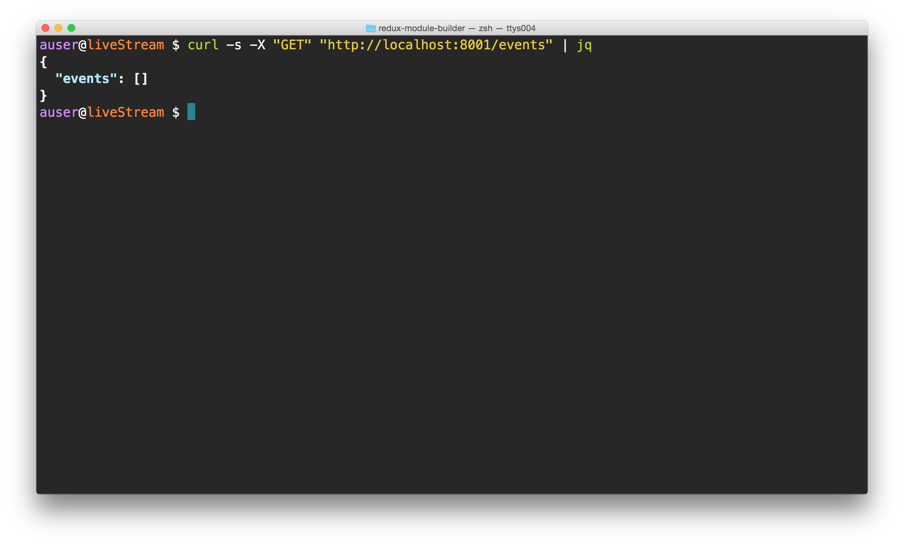
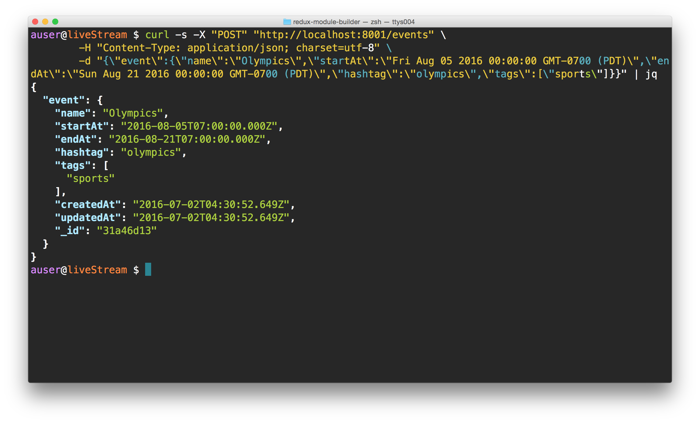
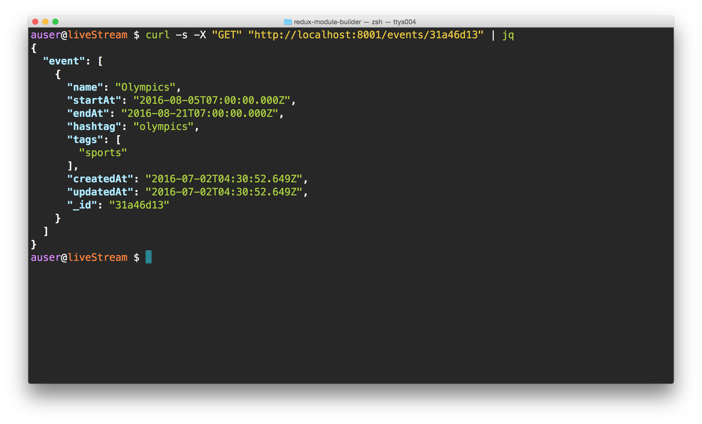
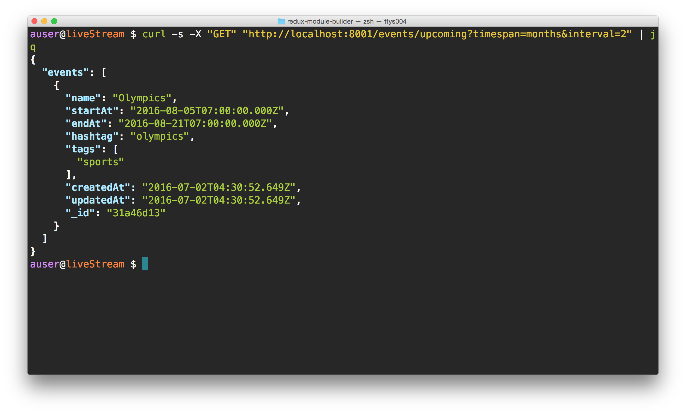
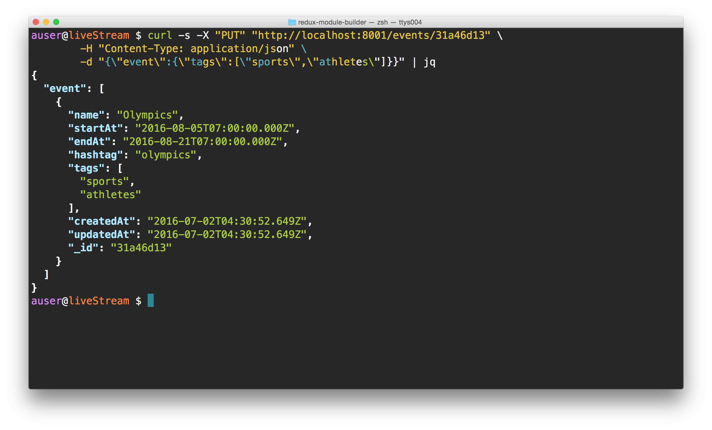
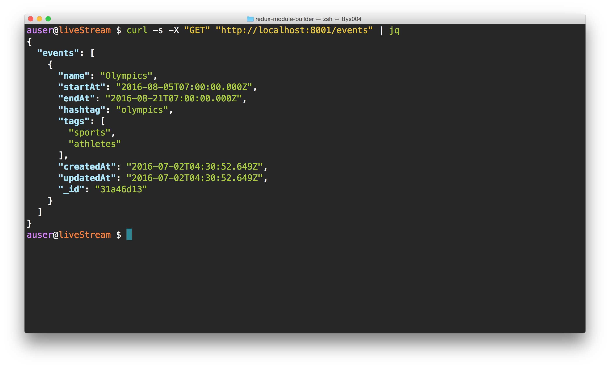

## Realtime news server

The `Realtime news` server is a demo server intended on working with demo front-end applications that hosts the following services.

It serves several end-points including a real-time twitter feed updates.

It includes the following methods to connect:

* REST
* websockets
* Server Sent Events (coming soon)

It is graciously built with the following technologies:

* [node](http://nodejs.org)
* [express](http://expressjs.com/)
* [linvodb3](https://github.com/Ivshti/linvodb3)
* [leveldown]()

We use the leveldb database to provide an easy method for connecting other datbase backends to the system in the future. For the time being, the `LinvoDB` API provides a nice wrapper around a single-node filesystem backend. Combining the speed of `NeDB` with the live query capabilities of leveldb, `LinvoDB` is a good choice for speed and single-node database requirements.

## Quickstart (locally)

To get this guy running, clone the repo and install the dependencies:

```bash
git clone https://github.com/fullstackio/realtime-news.git
cd realtime-news
npm install
```

All of the relevant scripts for managing the library are bundled in the `package.json`'s `scripts`. We'll start up our server in `dev` mode by using the `dev` script, like so:

```bash
npm run dev
```

Visit the url `http://localhost:3000` in your browser and you'll should see the running server.

## API Documentation

The backend server has several components, which mostly revolve around the events API.

> Note:
> We are using the `jq` tool to colorize the output of our terminal. We can't recommend `jq` enough. Install the tool if you want the same colorized, structured output in your terminal.

### Events

Events are the core model in the system. We'll use events to track relevant, immediate information for our live news streamer.

For current details about the `Event` schema, check the model at `./lib/models/event.js`. It currently holds the schema:

| Field | Type | Default value | Description |
|-------|------|---------------|-------------|
| name  | String | | The tite of the event, like `olympics` |
| startAt | Date | | The event starting date/time |
| endAt | Date | | The event's ending date/time |
| hashtag | String | | A hashtag to filter tweets |
| tags | [String] | [] | Other tags associated with the event |

#### List all events (`GET /events`)

First, let's check our events for any events current events:

```bash
curl -s -X "GET" "http://localhost:8001/events" | jq
```



Hrm, with no events, we can't really do very much. Let's add an event.

#### Add an event (`POST /events`)

```bash
curl -s -X "POST" "http://localhost:8001/events" \
	-H "Content-Type: application/json; charset=utf-8" \
	-d "{\"event\":{\"name\":\"Olympics\",\"startAt\":\"Fri Aug 05 2016 00:00:00 GMT-0700 (PDT)\",\"endAt\":\"Sun Aug 21 2016 00:00:00 GMT-0700 (PDT)\",\"hashtag\":\"olympics\",\"tags\":[\"sports\"]}}" | jq
```



After we've added an event, let's check to make sure it was added by using the `_id` event to query against.

#### GET event by id (`GET /events/:id`)

```bash
curl -s -X "GET" "http://localhost:8001/events/31a46d13" | jq
```



Certainly looks like our event has been added.

#### Get recent event (`GET /events/upcoming`)

We don't expect our users to know what the latest event ids are, so we'll provide a method for looking for the latest ones using an upcoming API.

To get the default upcoming events (i.e. all events upcoming from today forward), we can call the api without any query parameters:

```bash
curl -s -X "GET" "http://localhost:8001/events/upcoming" | jq
```


In cases that we don't want to list the entire events database and limit the timespan to a certain interval and timespan, we can pass the query options `timespan` and `interval`. For instance, to list only the upcoming events for the next two months:

```bash
curl -s -X "GET" "http://localhost:8001/events/upcoming?timespan=months&interval=2" | jq
```



> In this case, we still only have one event that starts in the next two months, so the output will be the same. However, this _is_ does provide a limit on the query.

#### Update an event (`PUT /events/:id`)

Let's add some details to our event by sending an update request to our backend using the update API. We'll use a similar syntax as the ADD an event API, but pass the event id in the URL

```bash
curl -s -X "PUT" "http://localhost:8001/events/31a46d13" \
        -H "Content-Type: application/json" \
        -d "{\"event\":{\"tags\":[\"sports\",\"athletes\"]}}" | jq
```



Let's check the event to make sure it's been updated in the database using our upcoming api:

```bash
curl -s -X "GET" "http://localhost:8001/events/upcoming" | jq
```


